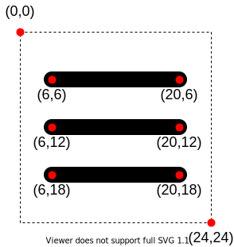
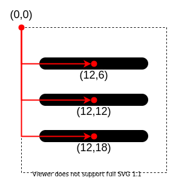

For the last couple of months, I have been working on a custom Hugo theme in my free time. Most recently, I implemented a CSS-only burger fold-out menu to increase its responsiveness. I based the implementation on [Erik Terwan's](https://twitter.com/erikterwan) nifty [pure CSS Hamburger fold-out menu](https://codepen.io/erikterwan/pen/EVzeRP) which is pretty popular on CodePen. I modernized it by utilizing SVG and newer CSS selectors to make the code more declarative and scalable. It comes with the price of not supporting as many browsers, but honestly, who cares about Internet Explorer users?

<!--more-->

<!-- markdownlint-disable MD033 -->
<style>
  .example {
    background: #3c3836;
    color: #ebdbb2;
    height: 200px;
    overflow: hidden;
    position: relative;
    width: 300px;
  }
</style>
<!-- markdownlint-enable MD033 -->

## What the Result Looks Like

Have a look at the result (it's interactive):

<!-- markdownlint-disable MD033 -->
<div class="example" id="example-result">
  <style>
    #example-result .menu-burger > * {
      position: absolute;
    }
    #example-result .menu-burger input {
      height: 32px;
      margin: 0;
      opacity: 0;
      width: 32px;
      z-index: 3;
    }
    #example-result .menu-burger svg {
      height: 32px;
      width: 32px;
      z-index: 2;
    }
    #example-result ul.menu-burger__item-list
    {
      background: #ebdbb2;
      bottom: 0;
      color: #3c3836;
      list-style: none;
      margin: 0;
      padding: 32px;
      top: 0;
      transform: translate(-100%, 0);
      transition: transform 0.5s cubic-bezier(0.9, 0, 0.1, 1);
      width: 200px;
      z-index: 1;
    }
    #example-result input:checked ~ .menu-burger__item-list {
      transform: none;
    }
    #example-result .menu-burger input:checked ~ svg line {
      stroke: #3c3836;
    }
    #example-result .menu-burger svg line:nth-of-type(1)
    {
      transform-origin: center 6px;
    }
    #example-result .menu-burger svg line:nth-of-type(2)
    {
      transform-origin: center 12px;
    }
    #example-result .menu-burger svg line:nth-of-type(3)
    {
      transform-origin: center 18px;
    }
    #example-result .menu-burger svg line {
      transition-duration: 0.5s;
      transition-property:
        stroke,
        opacity,
        transform;
      transition-timing-function: cubic-bezier(0.9, 0, 0.1, 1);
    }
    #example-result .menu-burger input:checked ~ svg line:nth-of-type(2) {
      opacity: 0;
      transform: scale(0.2);
    }
    #example-result .menu-burger input:checked ~ svg line:nth-of-type(1)
    {
      transform: translate(0, 6px) rotate(45deg);
    }
    #example-result .menu-burger input:checked ~ svg line:nth-of-type(3)
    {
      transform: translate(0, -6px) rotate(-45deg);
    }
  </style>
  <div class="menu-burger">
    <input type="checkbox" />
    <svg xmlns="http://www.w3.org/2000/svg" class="icon icon-tabler icon-tabler-menu-2" viewBox="0 0 24 24" stroke-width="2" stroke="currentColor" fill="none" stroke-linecap="round" stroke-linejoin="round">
      <path stroke="none" d="M0 0h24v24H0z" fill="none"/>
      <line x1="4" y1="6" x2="20" y2="6" />
      <line x1="4" y1="12" x2="20" y2="12" />
      <line x1="4" y1="18" x2="20" y2="18" />
    </svg>
    <ul class="menu-burger__item-list">
      <li>Item 1</li>
      <li>Item 2</li>
      <li>Item 3</li>
    </ul>
  </div>
</div>
<!-- markdownlint-enable MD033 -->

All of the illustrating examples use the following basic styling:

```css
.example {
  background: #3c3836;
  color: #ebdbb2;
  height: 200px;
  overflow: hidden;
  position: relative;
  width: 300px;
}
```

## Burger Anatomy

As a starting point, I chose the `menu-2` icon of the excellent, MIT-licensed [Tabler Icon suite](https://tablericons.com/):

```xml
<svg xmlns="http://www.w3.org/2000/svg" class="icon icon-tabler icon-tabler-menu-2" width="24" height="24" viewBox="0 0 24 24" stroke-width="2" stroke="currentColor" fill="none" stroke-linecap="round" stroke-linejoin="round">
  <path stroke="none" d="M0 0h24v24H0z" fill="none"/>
  <line x1="4" y1="6" x2="20" y2="6" />
  <line x1="4" y1="12" x2="20" y2="12" />
  <line x1="4" y1="18" x2="20" y2="18" />
</svg>
```

The icon looks like this:

<!-- markdownlint-disable MD033 -->
<svg xmlns="http://www.w3.org/2000/svg" class="icon icon-tabler icon-tabler-menu-2" width="240" height="240" viewBox="0 0 24 24" stroke-width="2" stroke="currentColor" fill="none" stroke-linecap="round" stroke-linejoin="round">
  <path stroke="none" d="M0 0h24v24H0z" fill="none"/>
  <line x1="4" y1="6" x2="20" y2="6" />
  <line x1="4" y1="12" x2="20" y2="12" />
  <line x1="4" y1="18" x2="20" y2="18" />
</svg>
<!-- markdownlint-enable MD033 -->

Here is a breakdown of the arrangement of the burger's three `<line />` elements inside the SVG:



When we later animate the lines, this will be important to know.

## Menu Skeleton

```html
<div class="menu-burger">
  <input type="checkbox" />
  <svg
    xmlns="http://www.w3.org/2000/svg"
    class="icon icon-tabler icon-tabler-menu-2"
    viewBox="0 0 24 24"
    stroke-width="2"
    stroke="currentColor"
    fill="none"
    stroke-linecap="round"
    stroke-linejoin="round"
  >
    <path stroke="none" d="M0 0h24v24H0z" fill="none" />
    <line x1="4" y1="6" x2="20" y2="6" />
    <line x1="4" y1="12" x2="20" y2="12" />
    <line x1="4" y1="18" x2="20" y2="18" />
  </svg>
  <ul class="menu-burger__item-list">
    <li>Item 1</li>
    <li>Item 2</li>
    <li>Item 3</li>
  </ul>
</div>
```

The menu contains the burger and a list of menu items inside `.menu-burger__item-list`, which initially is not displayed. The `<input type="checkbox" />` is used as an invisible, "CSS-only click handler" indicating the menu state. Let's add some initial CSS next:

```css
.menu-burger > * {
  position: absolute;
}

.menu-burger input {
  height: 32px;
  margin: 0;
  opacity: 0;
  width: 32px;
  z-index: 3;
}

.menu-burger svg {
  height: 32px;
  width: 32px;
  z-index: 2;
}

ul.menu-burger__item-list {
  background: #ebdbb2;
  bottom: 0;
  color: #3c3836;
  list-style: none;
  margin: 0;
  padding: 32px;
  top: 0;
  transform: translate(-100%, 0);
  transition: transform 0.5s cubic-bezier(0.9, 0, 0.1, 1);
  width: 200px;
  z-index: 1;
}

input:checked ~ .menu-burger__item-list {
  transform: none;
}

.menu-burger input:checked ~ svg line {
  stroke: #3c3836;
}
```

The most important things going on here are:

- Any direct descendant of `.menu-burger` is positioned `absolute`ly
- `menu-burger__item-list`, `svg`, and checkbox `input` are stacked on top of each other, ordered by `z-index`
- The dimensions of the `input` checkbox and `svg` exactly match
- To initially hide `menu-burger__item-list`, it's `translate`d out of view
- A `transition` animation with a custom [`cubic-bezier` easing-function](https://www.w3schools.com/CSSref/func_cubic-bezier.asp) is added to the `transform` property, so the fold-out of the menu looks nice. You can play with it on [cubic-bezier.com](https://cubic-bezier.com/#.9,0,.1,1).
- The "click handler" CSS magic is happening in `input:checked ~ .menu-burger__item-list`. `~` is the [subsequent-sibling combinator](https://www.w3.org/TR/selectors-3/#general-sibling-combinators). In this case it matches `.menu-burger__item-list` siblings of a `:checked` `input` checkbox and undoes the initial hiding `transition`.
- The same "click handler" logic is used to change the colors of the `line` elements from dark to light

The rest is self-explanatory, generic CSS styling. Here is what we have so far:

<!-- markdownlint-disable MD033 -->
<div class="example" id="example-skeleton">
  <style>
    #example-skeleton .menu-burger > * {
      position: absolute;
    }
    #example-skeleton .menu-burger input {
      height: 32px;
      margin: 0;
      opacity: 0;
      width: 32px;
      z-index: 3;
    }
    #example-skeleton .menu-burger svg {
      height: 32px;
      width: 32px;
      z-index: 2;
    }
    #example-skeleton ul.menu-burger__item-list
    {
      background: #ebdbb2;
      bottom: 0;
      color: #3c3836;
      list-style: none;
      margin: 0;
      padding: 32px;
      top: 0;
      transform: translate(-100%, 0);
      transition: transform 0.5s cubic-bezier(0.9, 0, 0.1, 1);
      width: 200px;
      z-index: 1;
    }
    #example-skeleton input:checked ~ .menu-burger__item-list {
      transform: none;
    }
    .menu-burger input:checked ~ svg line {
      stroke: #3c3836;
    }
  </style>
  <div class="menu-burger">
    <input type="checkbox" />
    <svg xmlns="http://www.w3.org/2000/svg" class="icon icon-tabler icon-tabler-menu-2" viewBox="0 0 24 24" stroke-width="2" stroke="currentColor" fill="none" stroke-linecap="round" stroke-linejoin="round">
      <path stroke="none" d="M0 0h24v24H0z" fill="none"/>
      <line x1="4" y1="6" x2="20" y2="6" />
      <line x1="4" y1="12" x2="20" y2="12" />
      <line x1="4" y1="18" x2="20" y2="18" />
    </svg>
    <ul class="menu-burger__item-list">
      <li>Item 1</li>
      <li>Item 2</li>
      <li>Item 3</li>
    </ul>
  </div>
</div>
<!-- markdownlint-enable MD033 -->

Now that we finished building the foundation, we can continue with the fun part!

## Animate the Burger

First, we style each `<line />` by using declarative [`nth-of-type` CSS selectors](https://developer.mozilla.org/en-US/docs/Web/CSS/:nth-of-type):

```css
.collapsible__menu svg line:nth-of-type(1) {
  stroke: red;
}

.collapsible__menu svg line:nth-of-type(2) {
  stroke: green;
}

.collapsible__menu svg line:nth-of-type(3) {
  stroke: blue;
}
```

This styles the first, second and third `line` of `svg` like so:

<!-- markdownlint-disable MD033 -->
<div id="example-rgb" class="collapsible__menu">
  <style>
    #example-rgb svg line:nth-of-type(1) {
      stroke: red;
    }
    #example-rgb svg line:nth-of-type(2) {
      stroke: green;
    }
    #example-rgb svg line:nth-of-type(3) {
      stroke: blue;
    }
  </style>
  <svg xmlns="http://www.w3.org/2000/svg" class="icon icon-tabler icon-tabler-menu-2" width="240" height="240" viewBox="0 0 24 24" stroke-width="2" stroke="currentColor" fill="none" stroke-linecap="round" stroke-linejoin="round">
    <path stroke="none" d="M0 0h24v24H0z" fill="none"/>
    <line x1="4" y1="6" x2="20" y2="6" />
    <line x1="4" y1="12" x2="20" y2="12" />
    <line x1="4" y1="18" x2="20" y2="18" />
  </svg>
</div>
<!-- markdownlint-enable MD033 -->

Let's take a step back and think about what the animation should do:

1. Fade out the middle `line` by [scaling](<https://developer.mozilla.org/en-US/docs/Web/CSS/transform-function/scale()>) it down and changing its `opacity` to 0
2. Rotate the top and bottom lines to form an **X**. One way to do this is to vertically center both lines and rotate them by 45 degrees in opposing directions around their center.

Before we get started, we have to understand [how transformation origins work](https://developer.mozilla.org/en-US/docs/Web/CSS/transform-origin) in CSS:

> The transform origin is the point around which a transformation is applied. For example, the transform origin of the `rotate()` function is the center of rotation.

In our case, the default transform-origin is `(0,0)`. So before we apply transformations, we have to move the transform-origins of every `line` to their respective center:



```css
.menu-burger svg line:nth-of-type(1) {
  transform-origin: center 6px;
}

.menu-burger svg line:nth-of-type(2) {
  transform-origin: center 12px;
}

.menu-burger svg line:nth-of-type(3) {
  transform-origin: center 18px;
}
```

Next, use the `cubic-bezier` function again and apply it to every `line` property to be animated:

```css
.menu-burger svg line {
  transition-duration: 0.5s;
  transition-property: stroke, opacity, transform;
  transition-timing-function: cubic-bezier(0.9, 0, 0.1, 1);
}
```

When clicked, we fade out the middle `line` of the burger:

```css
.menu-burger input:checked ~ svg line:nth-of-type(2) {
  opacity: 0;
  transform: scale(0.2);
}
```

Finally, we vertically center and then rotate the top and bottom `line`s:

```css
.menu-burger input:checked ~ svg line:nth-of-type(1) {
  transform: translate(0, 6px) rotate(45deg);
}

.menu-burger input:checked ~ svg line:nth-of-type(3) {
  transform: translate(0, -6px) rotate(-45deg);
}
```

## Wrapping Up

What do you think? Let me know in the comments or at me on Twitter.

[I created a JSFiddle](https://jsfiddle.net/dxLb79pu/3/) for you to play around with the code. Here is the entire CSS for reference:

```css
.example {
  background: #3c3836;
  color: #ebdbb2;
  height: 200px;
  overflow: hidden;
  position: relative;
  width: 300px;
}

.menu-burger > * {
  position: absolute;
}

.menu-burger input {
  height: 32px;
  margin: 0;
  opacity: 0;
  width: 32px;
  z-index: 3;
}

.menu-burger svg {
  height: 32px;
  width: 32px;
  z-index: 2;
}

ul.menu-burger__item-list {
  background: #ebdbb2;
  bottom: 0;
  color: #3c3836;
  list-style: none;
  margin: 0;
  padding: 32px;
  top: 0;
  transform: translate(-100%, 0);
  transition: transform 0.5s cubic-bezier(0.9, 0, 0.1, 1);
  width: 200px;
  z-index: 1;
}

input:checked ~ .menu-burger__item-list {
  transform: none;
}

.menu-burger input:checked ~ svg line {
  stroke: #3c3836;
}

.menu-burger svg line:nth-of-type(1) {
  transform-origin: center 6px;
}

.menu-burger svg line:nth-of-type(2) {
  transform-origin: center 12px;
}

.menu-burger svg line:nth-of-type(3) {
  transform-origin: center 18px;
}

.menu-burger svg line {
  transition-duration: 0.5s;
  transition-property: stroke, opacity, transform;
  transition-timing-function: cubic-bezier(0.9, 0, 0.1, 1);
}

.menu-burger input:checked ~ svg line:nth-of-type(2) {
  opacity: 0;
  transform: scale(0.2);
}

.menu-burger input:checked ~ svg line:nth-of-type(1) {
  transform: translate(0, 6px) rotate(45deg);
}

.menu-burger input:checked ~ svg line:nth-of-type(3) {
  transform: translate(0, -6px) rotate(-45deg);
}
```
