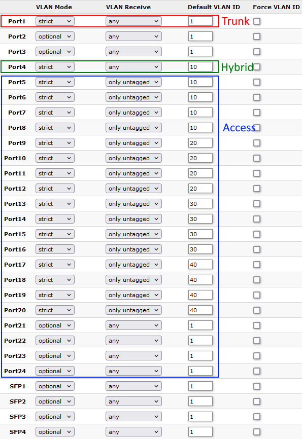

My homelab grew quite a bit over the past years. And with that, my networking needs also changed: stricter firewall rules, segregating untrusted IoT devices into separate networks, traffic prioritization, and more. I wanted to document my switch and VLAN configuration. And maybe this is useful for someone else, too.

<!--more-->

## Mikrotik CRS328-24P-4S+RM

The [Mikrotik CRS328-24P-4S+RM](https://mikrotik.com/product/crs328_24p_4s_rm) is a beefy Layer 3 (L3) switch. It features 24 Gigabit [Power over Ethernet (PoE)](https://en.wikipedia.org/wiki/Power_over_Ethernet) ports and four 10 Gbps SFP+ ports. It has a 500W power supply, so it'll be able to serve as a core switch for my homelab for a long time. It's rack-mountable and was significantly cheaper than comparable Ubiquiti gear I was considering at the time of the purchase. I also replaced its stock fans with [Noctua NF-A4x20](https://noctua.at/en/products/fan/nf-a4x20-pwm)s, making it completely silent. As long as I don't use too many PoE devices and keep an eye on the temperatures, these fans will dissipate enough heat for the time being. For routing, I use OPNsense, so I only need the L2 capabilities of the Mikrotik switch, which is why I run it on [SwOS](https://help.mikrotik.com/docs/display/SWOS/SwOS) instead of [RouterOS](https://help.mikrotik.com/docs/display/ROS/RouterOS). So, instructions in this guide also refer to SwOS.

## Terminology

[From Wikipedia](https://en.wikipedia.org/wiki/Router_on_a_stick):

> In computing, a router on a stick, also known as a one-armed router, is a router that has a single physical or logical connection to a network. It is a method of inter-VLAN (virtual local area networks) routing where one router is connected to a switch via a single cable.

When configuring VLANs, we usually encounter three types of port configurations (Cisco lingo):

- **Access Port**  
  Port carrying _untagged_ traffic for _one_ VLAN
- **Trunk Port**  
  Port carrying _tagged_ traffic for _multiple_ VLANs
- **Hybrid Port**  
  Port carrying _tagged_ and _untagged_ traffic for _multiple_ VLANs

The traffic of the **native** VLAN may traverse a trunk port.

## VLAN Overview

I like the convention of matching the third octet of the IP with the VLAN ID. I.e., assigning the VLAN with the ID **10** the address 192.168.**10**.0/24. Here is an overview of the VLANs I use:

| Description | VLAN ID | Subnet              |
| ----------- | ------- | ------------------- |
| Native      | 1       | 192.168.**1**.0/24  |
| Management  | 10      | 192.168.**10**.0/24 |
| VPN         | 20      | 192.168.**20**.0/24 |
| Clear       | 30      | 192.168.**30**.0/24 |
| Guest       | 40      | 192.168.**40**.0/24 |

<!-- TODO Check my [comprehensive OPNsense Baseline Guide with VPN, Guest, and VLAN Support](posts/opnsense-baseline-guide-with-vpn-guest-and-vlan-support) to learn more about my network design. -->

## Port Mapping

Here is how we're going to use the ports of the switch:

| Port      | Description                                 | VLANs                        |
| --------- | ------------------------------------------- | ---------------------------- |
| 1         | **Trunk** port connecting OPNsense          | 1 (untagged), 10, 20, 30, 40 |
| 2-3       | Not used                                    |                              |
| 4         | **Hybrid** port to Ubiquiti Unifi AP        | 10 (untagged), 20, 30, 40    |
| 5-8       | **Access** ports connecting Management VLAN | 10                           |
| 9-12      | **Access** ports connecting VPN VLAN        | 20                           |
| 13-16     | **Access** ports connecting Clear VLAN      | 30                           |
| 17-20     | **Access** ports connecting Guest VLAN      | 40                           |
| 21-24     | **Access** ports connecting native VLAN     | 1 (untagged)                 |
| SFP1-SFP4 | Not used                                    |                              |

Note the following:

- The **trunk** port carries all tagged VLAN traffic from the switch to OPNsense
- The **hybrid** port carries the tagged traffic of VLANs 20, 30, and 40 made available by the UniFi access point (AP) via WiFi. We also allow untagged VLAN 10 traffic because UniFi devices must communicate over an untagged network to be adopted by a UniFi controller. We could use VLAN 1 for this, but I like to use VLAN 1 for debugging and instead adopt UniFi devices over the management network.
- For security reasons, connecting to the management network is only allowed via physical cable connection
- The guest network is only available via WiFi

## Configure SwOS

The only thing missing now is configuring the VLANs. First, we enable **Independent VLAN Lookup** (IVL) on the **System** tab. We then add our VLANs and configure port isolation on the **VLANs** tab:

On the **VLAN** tab, we configure trunk, hybrid, and access ports:

Easy as that! [Check the official Mikrotik docs for more VLAN example configurations.](https://help.mikrotik.com/docs/pages/viewpage.action?pageId=76415036#CRS3xxandCSS32624G2S+seriesManual-VLANandVLANs)
